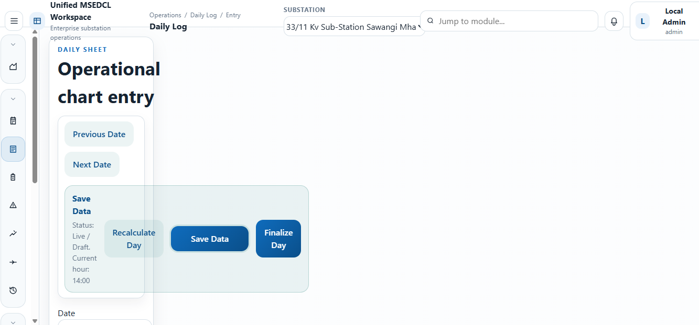

# Unified Workspace Gap Audit

This audit uses only the current `unified_msedcl_workspace` as the source of truth.

## Current implemented foundation

- `src/context/AuthContext.jsx`: login, logout, signup, forgot password, reset password, local SQL mode, Supabase-ready mode.
- `server/index.js`: local SQLite auth, users, substations, employees, dashboard summary.
- `src/pages/LoginPage.jsx`: auth UI.
- `src/pages/SubstationsPage.jsx`: substation master.
- `src/pages/EmployeesPage.jsx`: employee master.
- `src/pages/UsersPage.jsx`: admin-created user accounts.
- `src/pages/HomePage.jsx`: overview dashboard.
- `vite.config.js` and `scripts/dev-runner.mjs`: localhost-first web + local API flow.
- `capacitor.config.json`: Android packaging direction exists, but native report/share flow is not yet implemented.

## 1. Missing module list

### Authentication and role system

- Missing `super_admin` management UI.
- Missing `substation_user` role and route restrictions.
- Missing approval workflow UI for pending/rejected users.
- Missing user-substation mapping management.
- Missing audit trail UI for auth and admin actions.

### Master data

- Missing divisions master.
- Missing feeders master.
- Missing battery set master.
- Missing print settings.
- Missing company profile settings.
- Missing attendance rules settings.
- Missing user-substation mapping page.

### Attendance system

- Missing operator attendance editor.
- Missing technician attendance editor.
- Missing apprentice attendance editor.
- Missing outsource attendance editor.
- Missing advance shift chart module.
- Missing night allowance statement module.
- Missing monthly attendance summary module.
- Missing attendance validation rules and save/load APIs.

### DLR ERP system

- Missing daily log module.
- Missing battery maintenance module.
- Missing faults module.
- Missing maintenance module.
- Missing charge handover module.
- Missing history register.
- Missing report center.
- Missing month-end pack builder.
- Missing backup/import/export UI and APIs.

### Print / export system

- Missing reusable report shell.
- Missing reusable print header builder.
- Missing reusable metadata grid builder.
- Missing reusable compact table printer.
- Missing page break helpers.
- Missing PDF export path.
- Missing Android share path.
- Missing workbook export path.
- Missing CSV / JSON export helpers for reports.

### Mobile / APK

- Missing mobile-safe report action bar.
- Missing native or native-like PDF share flow.
- Missing mobile-first attendance entry layout.
- Missing offline-friendly persistence beyond the current localhost API.
- Missing parity checks between desktop and mobile report actions.

## 2. Missing print layout list

The current workspace has no formal office-ready report layouts implemented yet. Missing layouts include:

- Daily Log print layout
- Weekly Battery Maintenance Record print layout
- Daily Fault Report print layout
- Maintenance Log / Maintenance Register print layout
- Charge Handover print layout
- Operator attendance monthly sheet
- Technician attendance monthly sheet
- Apprentice attendance monthly sheet
- Outsource attendance monthly sheet
- Advance shift chart print
- Night allowance statement print
- Monthly attendance summary print
- Monthly Consumption Report print
- Daily Min/Max Summary print
- Monthly Min/Max Report print
- Monthly Interruption Report print
- Monthly Energy Balance / Loss Report print
- Feeder Load Trend Report print
- Abnormal Consumption Report print
- Event Impact Report print
- Data Completeness Report print
- Main INC vs Child Reconciliation Report print
- Month-end pack combined print layout

## 3. Missing formulas list

### Attendance formulas

- Month calendar generation with exact day labels.
- Shift cycle logic.
- Operator rotation logic.
- General duty auto-fill logic.
- Weekly off logic.
- Leave code resolution and totals.
- Night allowance counting and rate application.
- Monthly totals by employee and by code.
- Vacancy-aware employee rendering.
- CPF-under-name print formatting rules.

### DLR formulas

- Daily log summary metrics.
- Battery max/min/condition formulas.
- Generated battery remark logic.
- Total voltage and overall battery condition logic.
- Maintenance filtering and grouping.
- Fault duration and interruption aggregation.
- Charge handover pending-item carry forward support.
- History register normalization across modules.

### Monthly report formulas

- Monthly consumption derivation.
- Daily min/max derivation.
- Monthly min/max aggregation.
- Interruption aggregation by feeder and duration.
- Energy balance and loss derivation.
- Feeder load trend derivation.
- Abnormal consumption detection.
- Event impact aggregation.
- Data completeness percentage logic.
- Main incoming vs child reconciliation.

## 4. Missing mobile / APK parity list

- Reports currently have no PDF action usable on Android.
- Reports currently have no share/export action usable on Android.
- No report has a browser-print alternative for popup-restricted mobile environments.
- Attendance entry screens are not mobile-optimized because they do not exist yet.
- DLR form screens are not mobile-optimized because they do not exist yet.
- No offline report artifact cache exists for generated PDFs.
- No mobile-safe month-end pack export flow exists.

## 5. File-by-file implementation plan

### Existing files to extend

- `server/index.js`
  Add tables, seed support, validation helpers, master-data APIs, attendance APIs, DLR APIs, backup/import/export APIs, and report dataset APIs.
- `src/App.jsx`
  Add route map for masters, attendance, DLR modules, reports, and month-end pack.
- `src/components/AppShell.jsx`
  Add navigation groups and role-aware visibility for new modules.
- `src/context/AuthContext.jsx`
  Add richer role helpers and admin approval actions.
- `src/lib/localApi.js`
  Add client methods for masters, attendance, DLR, reports, backup/import/export, and settings.
- `src/index.css`
  Add report engine styles, print styles, mobile layout rules, action bar styles, and page-break-safe report classes.
- `src/pages/HomePage.jsx`
  Replace foundation-only dashboard with operational summary cards and quick links.
- `src/pages/UsersPage.jsx`
  Add approval flow, role selection, and substation mapping support.

### New frontend files to add

- `src/lib/dateUtils.js`
  Shared month/day generation and formatting helpers.
- `src/lib/reportFormats.js`
  Shared number, text, and office-print formatting helpers.
- `src/lib/exportUtils.js`
  JSON, CSV, workbook, and download helpers.
- `src/lib/reportPdf.js`
  PDF generation from the shared report DOM.
- `src/lib/shareUtils.js`
  Web Share and Capacitor share helpers.
- `src/lib/reportData.js`
  Business formulas for attendance, DLR summaries, and month-end report datasets.
- `src/lib/reportPresets.js`
  Shared column and metadata definitions for print layouts.
- `src/components/reporting/ReportDocument.jsx`
- `src/components/reporting/ReportHeader.jsx`
- `src/components/reporting/MetadataGrid.jsx`
- `src/components/reporting/SummaryCards.jsx`
- `src/components/reporting/ReportTable.jsx`
- `src/components/reporting/SectionTitle.jsx`
- `src/components/reporting/SignatureBlock.jsx`
- `src/components/reporting/ReportActions.jsx`
- `src/components/reporting/PageBreak.jsx`
- `src/components/forms/MasterDataManager.jsx`
- `src/components/forms/AttendanceEditor.jsx`
- `src/components/forms/DailyLogEditor.jsx`
- `src/components/forms/BatteryEditor.jsx`
- `src/components/forms/FaultEditor.jsx`
- `src/components/forms/MaintenanceEditor.jsx`
- `src/components/forms/ChargeHandoverEditor.jsx`
- `src/pages/MastersPage.jsx`
- `src/pages/AttendancePage.jsx`
- `src/pages/DailyLogPage.jsx`
- `src/pages/BatteryPage.jsx`
- `src/pages/FaultsPage.jsx`
- `src/pages/MaintenancePage.jsx`
- `src/pages/ChargeHandoverPage.jsx`
- `src/pages/HistoryRegisterPage.jsx`
- `src/pages/ReportCenterPage.jsx`
- `src/pages/MonthEndPackPage.jsx`

### Data model additions in local mode

- `master_records`
  For divisions, feeders, battery sets, print settings, and attendance rules.
- `app_settings`
  For company profile and print preferences.
- `user_substation_map`
  For mapping users to allowed substations.
- Extended `attendance_sheets`
  To store operator, technician, apprentice, outsource, shift chart, night allowance, and summary payloads.
- Extended `dlr_records`
  To store structured daily log, battery, faults, maintenance, charge handover, report snapshots, and history entries.

## Delivery sequence inside this workspace

1. Add the shared data and export foundation.
2. Add reusable report layout components and disciplined print CSS.
3. Build master-data management and company/print settings.
4. Build attendance module with formulas and print outputs.
5. Build DLR modules with structured report outputs.
6. Build monthly reports and month-end pack from derived datasets.
7. Wire Android-safe PDF/share/export actions from the same layout source.
8. Run localhost build verification and fix integration issues.
